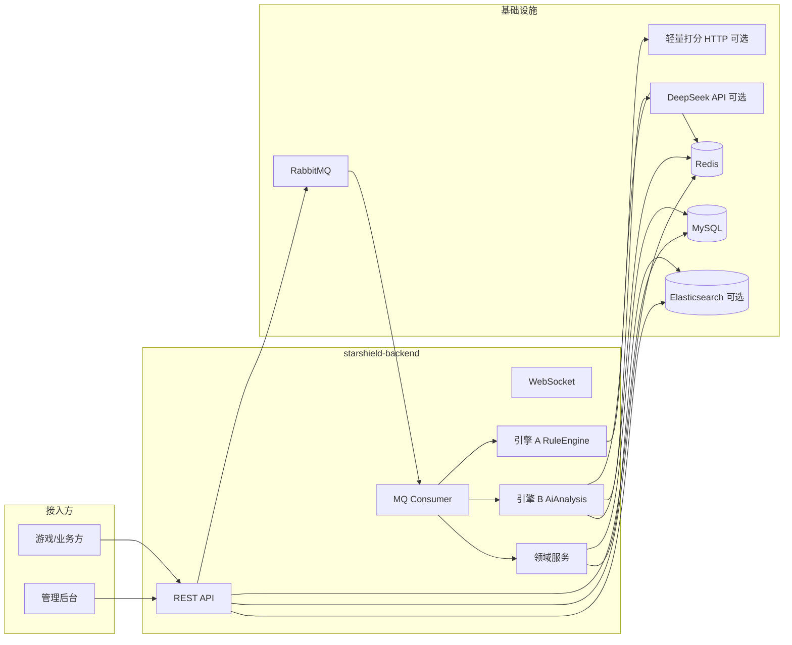

# 项目架构（StarShield）

StarShield（星盾）后端为 **Spring Boot** 单服务，负责游戏/社区 **聊天发言接入、双引擎审核、人工复核、检索与运营大屏**。默认工程路径：`starshield-backend/`。

## 逻辑架构

## 技术栈

| 层次 | 技术 |
|---|---|
| Web | Spring Web MVC，`server.port` 默认 `8080` |
| 数据访问 | MyBatis-Plus，主键雪花 `assign_id` |
| 消息 | Spring AMQP + RabbitMQ（JSON 消息转换器） |
| 缓存/配置 | Spring Data Redis（String 操作：敏感词 Set、Prompt 字符串） |
| 检索 | Spring Data Elasticsearch（可选；关闭时不初始化 Repository） |
| HTTP 客户端 | Spring `RestClient`（轻量模型、DeepSeek Chat Completions） |

业务开关与中间件地址见 `starshield-backend/src/main/resources/application.yml`。

## 模块与包结构（概要）

| 包 / 类 | 职责 |
|---|---|
| `controller.*` | HTTP 入口：接入、控制台、归档检索、管理审核、大屏 |
| `consumer.ChatMessageConsumer` | 异步消费发言，串联引擎 A/B 与落库 |
| `service.*` | 规则引擎、AI 分析、审核、归档同步、限流、幂等等 |
| `entity.*` | 与 MySQL 表映射 |
| `mapper.*` | MyBatis Mapper |
| `archive.*` | ES 文档与 Repository（可选） |
| `config.*` | RabbitMQ 交换机/队列/绑定、WebSocket 等 |

## 消息队列拓扑

与 `docs/event-spec.md` 一致，由 `RabbitMQConfig` 声明：

| 对象 | 名称 |
|---|---|
| 直连交换机 | `chat.direct.exchange` |
| 路由键 | `chat.message.routing.key` |
| 业务队列 | `chat.message.queue` |
| 死信交换机 | `chat.dl.exchange` |
| 死信路由键 | `chat.message.dl.routing.key` |
| 死信队列 | `chat.message.dlq` |

生产端（`ChatMessageController`）将 `ChatMessageLog` 序列化为 JSON 字符串投递；消费端手动 ACK，失败 NACK（不重回队列，依赖死信策略，具体以运维配置为准）。

## 数据存储分工

| 存储 | 角色 |
|---|---|
| **MySQL** | 权威业务库：发言记录、审计日志（见 `docs/database-design.md`） |
| **Redis** | 热更新敏感词、当前 Prompt 多版本键 |
| **Elasticsearch** | `starshield.archive.es-enabled=true` 时双写与检索优先；否则仅 MySQL 检索 |

## 外部依赖（AI 路径）

- **轻量打分**：`starshield.ai.lightweight-url`，默认 `http://localhost:5000/score`，POST JSON `{"text":"..."}`，期望响应含 `score`（0–1）。
- **DeepSeek**：`starshield.ai.deepseek-url`，默认官方 Chat Completions；需环境变量或 `.env` 中 `DEEPSEEK_API_KEY`（见 `AiAnalysisService`）。

## API 与文档索引

- 接口契约：`docs/api-spec.yaml`
- 错误码：`docs/error-codes.md`
- 字段字典：`docs/field-dictionary.md`
- MQ 契约：`docs/event-spec.md`

## 业务流进一步说明

审核合并规则、状态与人工流程见 **`docs/business-logic.md`**。
