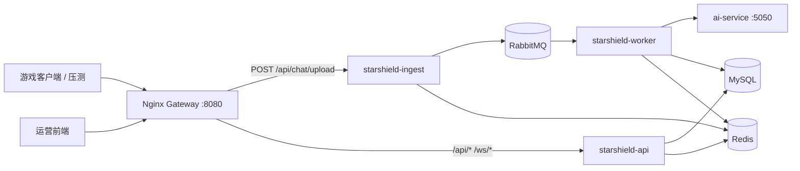

# Docker 微服务部署（降低接入延迟）

> 将单体 `starshield-backend` 拆为三个可独立扩缩容的 JVM 进程，通过 Nginx 网关统一对外暴露 **8080**。

## 架构



## 为什么能降低延迟

| 优化点 | 说明 |
|--------|------|
| **接入专用 JVM** | `ingest` 仅做 Redis 分布式限流 + JSON + MQ 投递，不加载 MyBatis / 消费者 / WebSocket |
| **线程池隔离** | 审核、大屏、HTTP 接入不再共享同一 Tomcat 400 线程 |
| **容器内网调用** | Worker → `ai-service:5050` 走 Docker bridge，避免 host 回环与端口映射 |
| **Worker 可横向扩容** | `docker compose up --scale starshield-worker=3` 提升消费吞吐，不拖累接入 P99 |

## 运行时模式

通过 `starshield.runtime.mode` 控制 Spring Bean 加载（见 `@EnabledOnMode`）：

| 模式 | 职责 | Profile |
|------|------|---------|
| `ingest` | `POST /api/chat/upload` | `docker,docker-ingest` |
| `worker` | MQ 消费 + 引擎 A/B + 落库 | `docker,docker-worker` |
| `api` | 管理 / 检索 / 大屏 / WS | `docker,docker-api` |
| `monolith` | 本地开发默认（全功能） | — |

## 快速启动

```bash
# 仓库根目录
docker compose up -d --build

# 查看状态
docker compose ps

# 扩容 worker / ingest
docker compose up -d --scale starshield-worker=2 --scale starshield-ingest=2
```

**对外入口**：`http://localhost:8080`（与单体开发端口一致）

**自检**：

```bash
curl -s http://localhost:8080/api/dashboard/metrics | head -c 200
curl -s -X POST http://localhost:8080/api/chat/upload \
  -H 'Content-Type: application/json' \
  -d '{"playerId":"docker_p1","content":"docker微服务测试","platform":"OTHER"}'
```

## 前端联调

`starshield-frontend/vite.config.js` 已默认代理到 `8080`，Docker 网关启动后无需改代码：

```bash
cd starshield-frontend && npm run dev
# 浏览器 http://localhost:5173
```

## 环境变量（常用）

| 变量 | 默认 | 说明 |
|------|------|------|
| `MYSQL_PASSWORD` | `starshield` | MySQL root 密码 |
| `STARSHIELD_AI_PROVIDER` | `lightweight` | worker AI 提供方 |
| `STARSHIELD_AI_LIGHTWEIGHT_URL` | `http://ai-service:5050/score` | 轻量模型地址 |
| `STARSHIELD_ES_ENABLED` | `false` | 是否启用 ES 归档 |
| `STARSHIELD_RATE_LIMIT_GLOBAL_QPS` | `20000` | 全局接入 QPS |
| `STARSHIELD_RATE_LIMIT_IP_QPS` | `300` | 单 IP 接入 QPS |
| `STARSHIELD_RATE_LIMIT_PLAYER_QPS` | `30` | 单玩家接入 QPS |

## 接入限流

`starshield-ingest` 依赖 Redis 执行 Lua 原子固定窗口计数，扩容多个 ingest 实例时仍共享全局 / IP / player 三类限流。Redis 短暂不可用时默认降级到本机固定窗口；生产环境如需 fail-closed，可设置 `STARSHIELD_RATE_LIMIT_FALLBACK_TO_LOCAL=false`。

## 本地仍用单体

不影响现有流程，`mvn spring-boot:run` 默认 `starshield.runtime.mode=monolith`。

## 停止与清理

```bash
docker compose down        # 保留 MySQL 卷
docker compose down -v     # 删除数据卷
```
